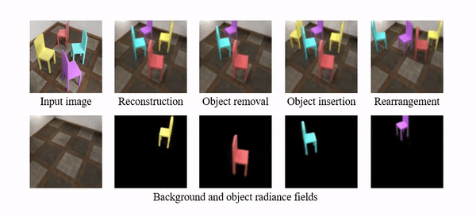

# [ICLR22] Unsupervised Discovery of Object Radiance Fields
by [Hong-Xing Yu](https://kovenyu.com), [Leonidas J. Guibas](https://geometry.stanford.edu/member/guibas/) and [Jiajun Wu](https://jiajunwu.com/) from Stanford University.



arXiv link: [https://arxiv.org/abs/2107.07905](https://arxiv.org/abs/2107.07905)

Project website: [https://kovenyu.com/uorf](https://kovenyu.com/uorf)


## Environment
We recommend using Conda:
```sh
conda env create -f environment.yml
conda activate uorf-3090
```
or install the packages listed therein. Please make sure you have NVIDIA drivers supporting CUDA 11.0, or modify the version specifictions in `environment.yml`.

## Data and model
Please download datasets and models [here](https://office365stanford-my.sharepoint.com/:f:/g/personal/koven_stanford_edu/Et9SOVcOxOdHilaqfq4Y3PsBsiPGW6NGdbMd2i3tRSB5Dg?e=WRrXIh).
If you want to train on your own dataset or generate your own dataset similar to our used ones, please refer to this [README](data/README.md).

## Evaluation
We assume you have a GPU.
If you have already downloaded and unzipped the datasets and models into the root directory,
simply run
```sh
bash scripts/eval_nvs_seg_chair.sh
```
from the root directory. Replace the script filename with `eval_nvs_seg_clevr.sh`, `eval_nvs_seg_diverse.sh`,
and `eval_scene_manip.sh` for different evaluations. Results will be saved into `./results/`.
During evaluation, the results on-the-fly will also be sent to visdom in a nicer form, which can be accessed from
[localhost:8077](http://localhost:8077).

## Training
We assume you have a GPU with no less than 24GB memory (evaluation does not require this as rendering can be done ray-wise but some losses are defined on the image space),
e.g., 3090. Then run
```shell
bash scripts/train_clevr_567.sh
```
or other training scripts. If you unzip datasets on some other place, add the location as the first parameter:
```shell
bash scripts/train_clevr_567.sh PATH_TO_DATASET
```
Training takes ~6 days on a 3090 for CLEVR-567 and Room-Chair, and ~9 days for Room-Diverse.
It can take even longer for less powerful GPUs (e.g., ~10 days on a titan RTX for CLEVR-567 and Room-Chair).
During training, visualization will be sent to [localhost:8077](http://localhost:8077).

## Bibtex
```
@inproceedings{yu2022unsupervised,
  author    = {Yu, Hong-Xing and Guibas, Leonidas J. and Wu, Jiajun},
  title     = {Unsupervised Discovery of Object Radiance Fields},
  booktitle = {International Conference on Learning Representations},
  year      = {2022},
}
```

## Acknowledgement
Our code framework is adapted from Jun-Yan Zhu's [CycleGAN](https://github.com/junyanz/pytorch-CycleGAN-and-pix2pix).
Some code related to adversarial loss is adapted from [a pytorch implementation of StyleGAN2](https://github.com/rosinality/stylegan2-pytorch).
Some snippets are adapted from pytorch [slot attention](https://github.com/lucidrains/slot-attention) and [NeRF](https://github.com/yenchenlin/nerf-pytorch).
If you find any problem please don't hesitate to email me at koven@stanford.edu or open an issue.
